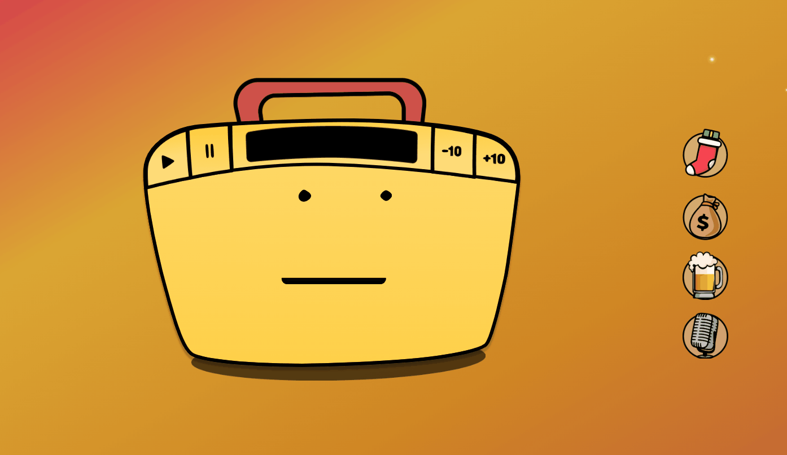
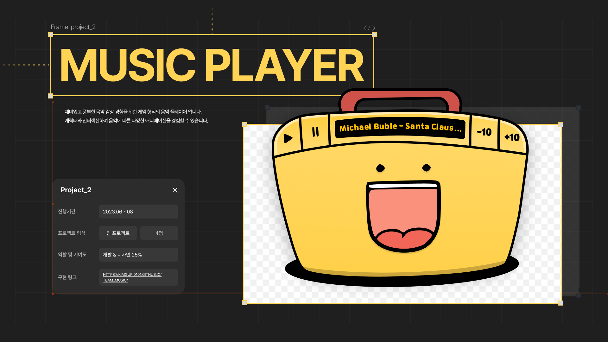
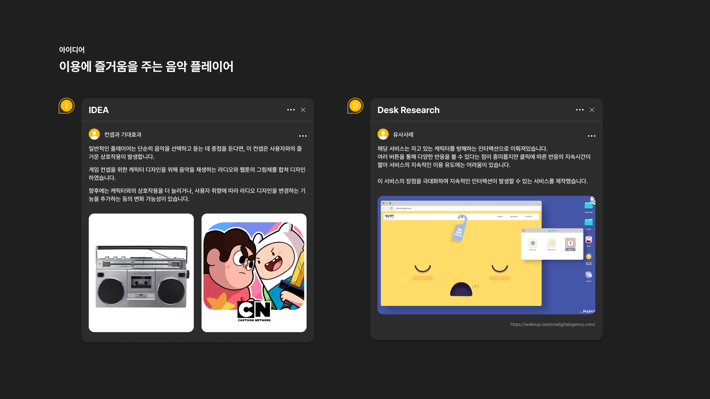
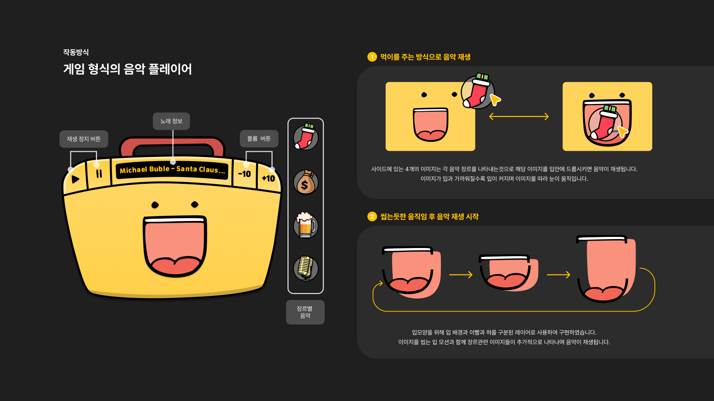
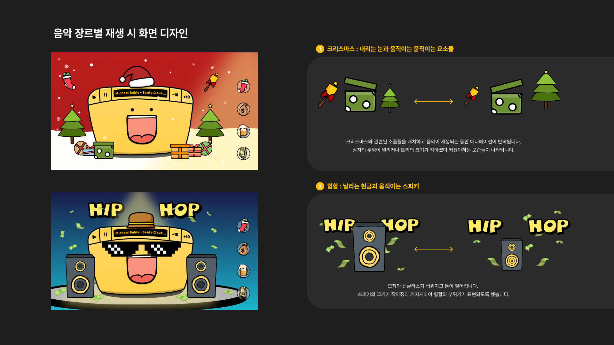
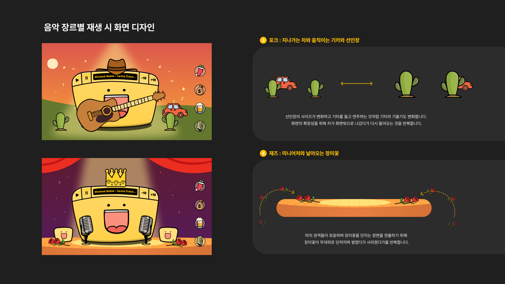

# Radio Character — 라디오 캐릭터 컨셉의 인터랙티브 음악 플레이어



> 아이템을 캐릭터의 입으로 드래그하면 음악이 재생되는  
> **드래그 앤 드롭 기반 인터랙티브 음악 플레이어**

🔗 [라이브 서비스 보러가기](https://rlarbfl081513.github.io/team_music/)

---

## 서비스 소개



- 기존 리스트형 음악 플레이어는 기능 중심적이고 단조로워 시각적 즐거움과 능동적 경험을 주는 데 한계가 있었음
- '라디오 캐릭터'라는 독창적인 오브젝트와 드래그 앤 드롭 인터랙션을 결합해 사용자가 직접 아이템을 캐릭터에게 전달하며 음악을 감상하는 유희적 플레이어를 개발

---

## 프로젝트 정보

| 항목 | 내용 |
|------|------|
| 진행 기간 | 2023.06 - 08 |
| 프로젝트 형식 | 팀 프로젝트 4명 |
| 역할 | Interaction Developer (개발 기여도 100%) |
| 기술 스택 | HTML, CSS, JavaScript |

---

## 기획 배경



- 단순히 음악을 선택하고 듣는 기능 중심 플레이어에서 벗어나 사용자와의 즐거운 상호작용이 발생하는 서비스를 기획
- 라디오와 웹툰 캐릭터 디자인을 결합한 게임 컨셉으로 지속적인 인터랙션이 가능한 서비스 제작

---

## 작동 방식



- **먹이를 주는 방식으로 음악 재생** — 사이드의 4개 아이템을 캐릭터 입으로 드래그하면 해당 테마 음악 즉시 재생
- **씹는 듯한 움직임 후 음악 재생 시작** — 입 배경, 이빨, 혀를 분리된 레이어로 구현해 자연스러운 씹는 모션 표현
- 아이템이 입과 가까워질수록 입이 커지며 눈이 아이템을 따라 움직이는 인터랙션 구현

---

## 음악 장르별 화면 디자인







| 장르 | 테마 요소 |
|------|----------|
| 크리스마스 | 내리는 눈, 움직이는 트리와 선물 |
| 힙합 | 날리는 현금, 움직이는 스피커 |
| 포크 | 지나가는 차, 움직이는 기카와 선인장 |
| 재즈 | 미니어처와 날아오는 장미꽃 |

---

## 주요 구현 내용

### 1. 드래그 앤 드롭 충돌 감지 시스템

- 마우스 이벤트로 아이템 위치값을 실시간 추적
- 캐릭터 입 영역과의 충돌 감지 알고리즘 구현
- 아이템이 입에 닿는 순간 시각적 피드백과 음악 전환이 즉시 발생하도록 처리

```javascript
// 실시간 좌표 추적 및 충돌 감지
function checkCollision(itemRect, targetRect) {
  return !(
    itemRect.right < targetRect.left ||
    itemRect.left > targetRect.right ||
    itemRect.bottom < targetRect.top ||
    itemRect.top > targetRect.bottom
  );
}
```

### 2. 오디오 엔진 제어

- 각 아이템에 매칭된 오디오 파일 호출
- 재생 / 정지 / 전환 관리하는 오디오 플레이어 로직 개발

```javascript
// 아이템별 오디오 매핑 및 전환
function playThemeMusic(theme) {
  if (currentAudio) currentAudio.pause();
  currentAudio = new Audio(themeAudioMap[theme]);
  currentAudio.play();
}
```

### 3. UI/UX 애니메이션 구현

- 디자인 가이드 기반 캐릭터와 아이템의 동적 움직임을 코드로 구현
- 입 배경, 이빨, 혀를 레이어로 분리해 씹는 모션 자연스럽게 표현
- 디자인과 개발 간 간극 없는 고품질 결과물 완성

---

## 성과

- 별도 설명 없이도 누구나 직관적으로 사용할 수 있는 인터페이스로 높은 평가
- 독창적인 오브젝트와 드래그 인터랙션의 결합으로 재미있는 사용자 경험 제공
